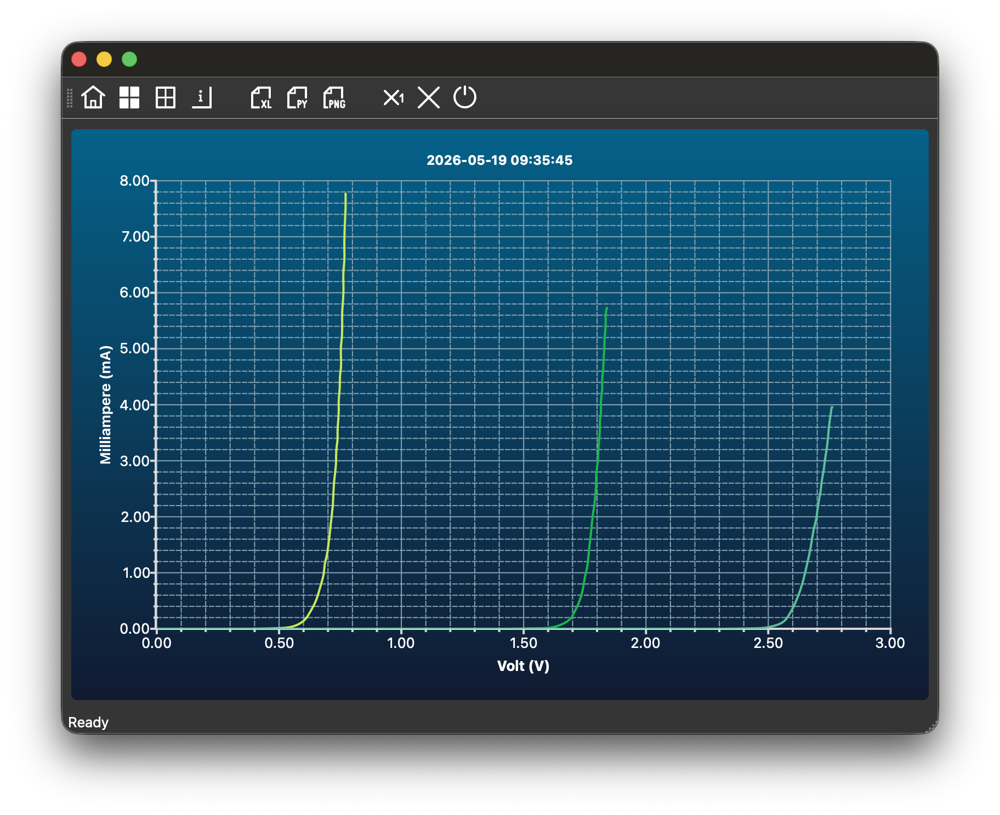
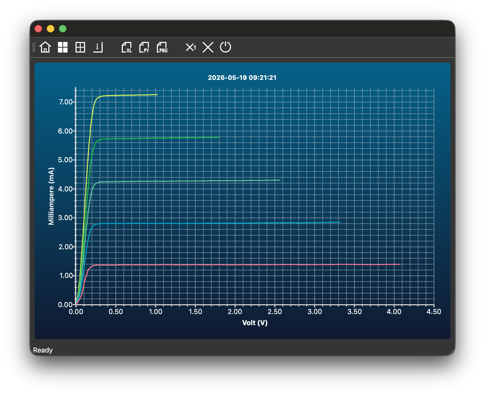

# DiodeScoutUI

DiodeScoutUI is a Qt 6 desktop application for visualizing diode I-V
characteristics measured with the DiodeScout device.

## Features

* Serial data acquisition
* Plotting with Qt Charts
* Export to PNG, CSV, and Python script
* Computation of piecewise-linear diode model
* Simulation mode for testing without physical hardware

## Source Code

The full source code is available on GitHub:

👉 [View project on GitHub](https://github.com/t4n/DiodeScoutUI)

## Screenshots

### Diode Measurement

### Transistor Measurement

## License

Copyright (C) 2026 Tilman Küpper

DiodeScoutUI is licensed under the GNU GPLv3.
